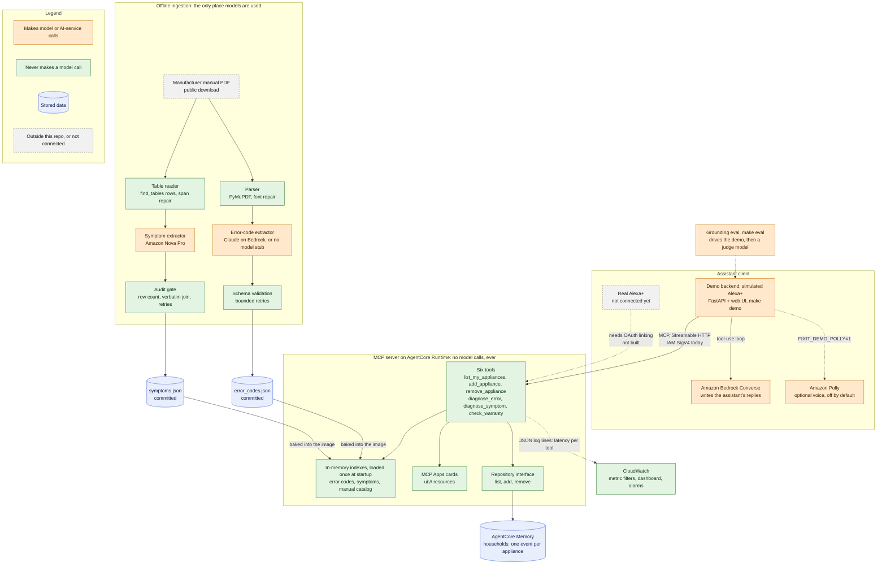

# Architecture

FixIt is a small, fast lookup server (an MCP server) that sits between an
assistant and a set of manual-derived data files. This page shows how the pieces
fit and, above all, **which parts make model calls and which never do**.

The one rule everything else follows: **the live server never calls a model.** Its
tools are in-memory lookups over files that were built offline. All AI work
(reading manuals, extracting records) happens ahead of time, in a separate
ingestion pipeline, and is checked before anything is committed. The assistant
that talks to the customer does the language generation, from the structured
results the tools return.

The same diagram as an image, for slides and write-ups:
[`docs/images/architecture.svg`](images/architecture.svg) and
[`docs/images/architecture.png`](images/architecture.png). The Mermaid source is
[`docs/images/architecture.mmd`](images/architecture.mmd); regenerate both images
with `mmdc -i docs/images/architecture.mmd -o docs/images/architecture.png -b white -s 2`
(Mermaid CLI, `@mermaid-js/mermaid-cli`).

## Which parts make model calls

| Part | Model or AI-service calls? | Where |
|---|---|---|
| MCP server and its six tools | **Never.** | Lookups over in-memory indexes; a test checks the symptom path imports no model or ingestion code. |
| Household store (AgentCore Memory) | No: it is a storage API, not a model. | `fixit_mcp.repository` |
| Error-code extraction (offline) | Yes: Claude on Amazon Bedrock, or a no-network stub that finds codes only. | `make add-manual`, `make extract-codes` |
| Symptom extraction (offline) | Yes: Amazon Nova Pro only (any other model id is refused). | `make extract-symptoms` |
| Demo backend (simulated Alexa+) | Yes: Amazon Bedrock Converse writes the replies; Amazon Polly speaks them if switched on. | `make demo` |
| Grounding eval (offline) | Yes: it drives the demo, and a second model acts as judge. | `make eval` |
| CloudWatch observability | No. | `make observability` |

## Components

**Assistant client.** The real Alexa+ client is not connected: the Alexa+
developer tools (account linking, the local inspector, add-on submission) are not
available to hackathon participants, and the deployed server accepts only
AWS-signed requests. In its place the **demo backend** (`demo/`, a FastAPI app with
a small web page) plays Alexa+'s role: it is a real MCP client that runs a
tool-use loop on Amazon Bedrock Converse, passes the household id to the tools,
fetches the tool's MCP Apps card, and renders it in a sandboxed iframe. Every
response is labelled `"simulated_alexa_plus": true`. Spoken replies use the
browser's voice unless `FIXIT_DEMO_POLLY=1` switches on Amazon Polly (off by
default, demo only, with a per-run character cap).

**MCP server.** Built on the official Python SDK (`mcp>=1.30,<2`), speaking MCP
2025-11-25 over Streamable HTTP in stateless mode at `0.0.0.0:8000/mcp`, and
negotiating the older `2025-03-26` version the Alexa+ documentation shows its
client sending. It runs on Amazon Bedrock AgentCore Runtime as an arm64 container
(`make docker-build`, `make docker-push`, `make deploy-runtime`), pinned to the
image digest, with IAM (SigV4) inbound auth and no OAuth. It has six tools:
`list_my_appliances`, `add_appliance`, `remove_appliance`, `diagnose_error`,
`diagnose_symptom` and `check_warranty` (a date comparison only, never a coverage
claim). Every call logs its latency in milliseconds as a JSON line.

**In-memory indexes.** At startup the server loads `data/index/error_codes.json`
(46 records from five manuals) and `data/index/symptoms.json` (114 rows from the GE
refrigerator and washer) once, plus a small catalog from
`data/manuals/manifest.yaml`. Both indexes are committed files, baked into the
container image; there is no file or network access in the request path, which is
what keeps tool calls fast. `diagnose_error` is an exact-code lookup that never
guesses (an unknown code is `not_found`, with the nearest known codes).
`diagnose_symptom` is deterministic keyword matching with a reviewed synonym
table, a minimum score, and a not-found path; it prefers `not_found` to a wrong
answer, and it is still keyword-based, so it can miss things.

**MCP Apps cards.** `diagnose_error` and `diagnose_symptom` each declare a
`ui://` resource on their tool definition (`_meta.ui.resourceUri`). The resource is
one self-contained HTML document that receives the result from the host over
`postMessage` and renders it; it has no network access and no click handlers. The
plain structured result is unchanged by it. The demo page hosts these cards; they
have not been verified on a real Alexa+ device.

**Household memory.** A household's appliances are kept behind a three-method
interface (`ApplianceRepository`: list, add, remove). Three implementations exist:
in-memory (tests), SQLite (the local default) and AgentCore Memory (the deployed
one, because each AgentCore Runtime session is a fresh microVM with no shared
disk). In AgentCore Memory each household is an actor and each appliance one
event; events expire after at most 365 days. The server never seeds data at
runtime. The household id is a plain parameter chosen by the caller: there is no
account linking yet.

**Offline ingestion.** Two paths from a manufacturer's public manual PDF to a
committed index, neither ever run inside a request.
*Error codes:* the parser (PyMuPDF) splits the manual into section-aware chunks
and repairs two manuals' broken font encoding; the extractor (Claude on Bedrock,
or the no-model stub) turns code tables into structured records; each record is
validated against a schema with bounded retries, and the extractor returns nothing
rather than guess; records are merged into `error_codes.json`.
*Symptoms:* the table reader takes each "Problem / Possible Causes / What To Do"
table from the PDF's geometry, so rows stay aligned; Amazon Nova Pro copies each
row verbatim; an audit gate checks the expected row count and that each row's
strings, joined, equal the source cell exactly, retrying on an empty, short or
wrong answer; only rows from fully passing tables are written to `symptoms.json`.
A spending cap and an estimate-first prompt guard every Bedrock call.

**Demo backend with Bedrock and Polly.** See the client above. It is evaluation
and demo tooling: the server never imports it and never calls Polly.

**Observability.** `make observability` creates four CloudWatch metric filters on
the runtime's log group (built from the server's own log lines), a `FixIt`
dashboard, and two alarms (`fixit-errors`, and handler p95 latency above 300 ms)
that email an SNS topic. It is a server-side view: a `504` from AgentCore's front
door for a request that never reached the container leaves no log line of ours, so
it may not appear.

**Grounding eval.** `make eval` runs scripted conversations (about 70) through the
demo against the local server and grades each reply with deterministic checks and
a judge model that sees only the tool results and the reply. It exists to check
that the assistant says only what the tools returned; see
[`CONTRIBUTING.md`](../CONTRIBUTING.md#how-we-measure-grounding) for what it can
and cannot catch.

## Known limits of this architecture

- Inbound auth is IAM only, so the real Alexa+ cannot call the deployed server.
- A brand-new AgentCore Runtime session takes about 5 seconds; warm calls are much
  faster (about 570 ms from Dhaka, of which about 320 ms is network). The
  in-region latency is an estimate, not a measurement.
- A new manual reaches the deployed server only after an image rebuild and a
  runtime update, because the indexes are baked into the image.
- The error-code and symptom indexes are only as good as extraction and the
  audit; see `FRICTION_LOG.md` for the failure modes found so far.
